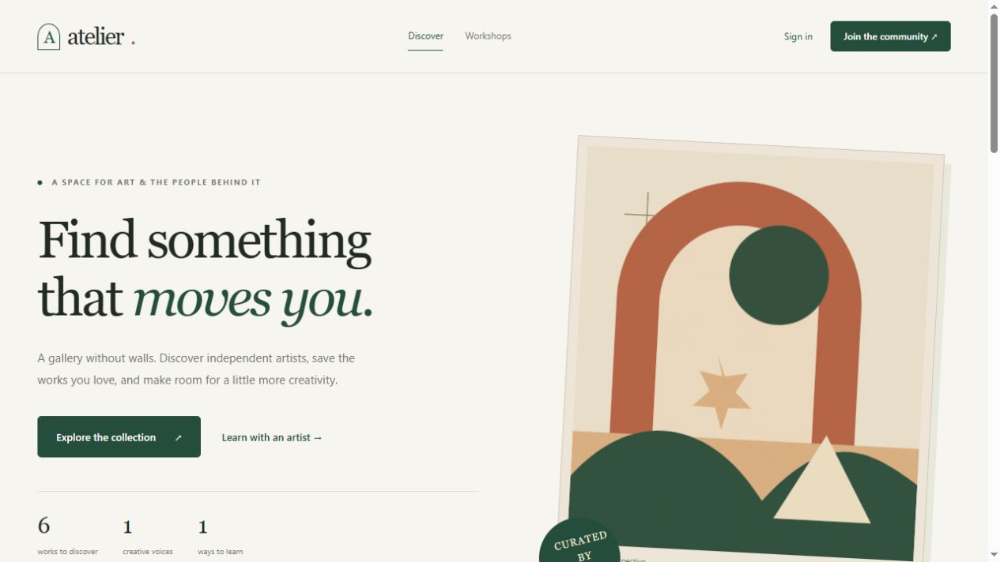

# Atelier — Gallery web app

A full-stack art community built with Angular 21, TypeScript, Node.js, Express 5, MongoDB, and optional Redis caching. Discover artwork, collect favorites, follow artists, post reviews, publish images, and create or join workshops.

The original Pug application has been migrated to a standalone Angular client and a typed REST API. Existing MongoDB collections and uploaded images remain compatible.



## Run the portfolio demo

Requirements: Node.js 22.14 or newer and npm. No separately installed MongoDB server is needed for the isolated demo.

```sh
npm ci
npm run build
npm run demo
```

Open [http://localhost:3000](http://localhost:3000).

| Account | Username       | Password            |
| ------- | -------------- | ------------------- |
| Patron  | `demo`         | `gallery-demo-2026` |
| Artist  | `Maya Laurent` | `gallery-demo-2026` |

The demo starts a temporary MongoDB process, creates sample artwork using bundled illustrations, and stores uploads in a temporary directory. It never connects to the database in `.env`. All demo changes disappear after shutdown. The first run may download a MongoDB binary. Stop with Ctrl+C.

## Run with your MongoDB database

Copy `.env.example` to `.env`, set `MONGODB_URI`, and generate a `JWT_SECRET`:

```sh
node -e "console.log(require('node:crypto').randomBytes(32).toString('hex'))"
```

Use a running local or hosted MongoDB instance. The default database is `mongodb://127.0.0.1:27017/TP`.

```sh
npm run dev
```

Open [http://localhost:4200](http://localhost:4200). Angular serves the client and proxies `/api` and `/uploads` to Express on port 3000. Both processes restart or reload as files change. If you change the API port, update `client/proxy.conf.json` accordingly.

For the compiled application, Express serves both the API and Angular:

```sh
npm run build
npm start
```

Open [http://localhost:3000](http://localhost:3000). Build before starting: compiled files are intentionally excluded from Git.

### Optional original development fixtures

```sh
npm run seed
```

Seeding inserts missing accounts and artwork from `JSON/`, preserving existing documents, passwords, reviews, likes, and workshops. It never drops the database and is disabled in production. The original fixture accounts remain `khalifa` / `yes` and each seeded artist's name / `no`; these weak credentials are for development only. New registrations require at least eight password characters. Some original artwork URLs may no longer resolve; the client displays an image placeholder.

## What the project demonstrates

- **Angular + TypeScript:** standalone components, lazy routes, strict template checking, reactive forms, reusable cards, route guards, and responsive layouts.
- **RxJS + NgRx SignalStore:** debounced, cancellable search with URL filters and pagination; shared authentication state restored from the API; explicit loading, empty, and error states.
- **Node.js + Express REST API:** shared request/response contracts, field validation, consistent JSON errors, and role/ownership checks on server-side mutations.
- **MongoDB + Mongoose:** compatible account/artwork models, weighted text search, category/artist indexes, database-side workshop pagination, atomic duplicate prevention, and TTL session expiry.
- **Redis:** cache-aside public artwork discovery and statistics, TTL expiry, write invalidation, concurrent-request coalescing, safe MongoDB fallback, and connection recovery. Personalized responses bypass the shared cache.
- **Authentication:** salted scrypt password hashes, signed JWTs in HttpOnly cookies, revocable MongoDB auth sessions, login throttling, and browser-origin validation. No tokens are stored in localStorage.
- **Verification:** isolated MongoDB integration tests, Angular HTTP/state/form tests, production builds, formatting checks, and browser verification of complete user flows.

See [REST API](docs/API.md), [architecture](docs/ARCHITECTURE.md), [Redis setup](docs/REDIS.md), and [change history](docs/CHANGELOG.md) for implementation details and an example resume description.

## Enable Redis

Connect to a running local or hosted Redis server and set these values in `.env`:

```dotenv
REDIS_URL=redis://127.0.0.1:6379
REDIS_CACHE_TTL_SECONDS=60
REDIS_KEY_PREFIX=gallery-web-app
```

Use a `rediss://` URL for TLS-enabled hosted Redis. Restart the server after changing configuration. Redis is optional: a blank URL disables caching, and an unavailable server causes reads to fall back to MongoDB. MongoDB continues to store all accounts, artwork, and auth sessions.

`GET /api/health` reports Redis as `disabled`, `ready`, or `unavailable`. Statistics and artwork-list responses expose `X-Cache: MISS`, `HIT`, or `BYPASS`; repeated anonymous requests become hits until expiry or a relevant write. Signed-in artwork lists always bypass caching.

The demo supports Redis through environment variables, for example `$env:REDIS_URL='redis://127.0.0.1:6379'` in PowerShell before `npm run demo`. Its temporary MongoDB URI gives it a separate cache namespace. The demo command does not automatically read `.env`.

## Configuration

| Variable                  | Purpose                                                       | Default                               |
| ------------------------- | ------------------------------------------------------------- | ------------------------------------- |
| `MONGODB_URI`             | MongoDB connection string                                     | `mongodb://127.0.0.1:27017/TP`        |
| `PORT`                    | Express HTTP port                                             | `3000`                                |
| `JWT_SECRET`              | JWT signing secret; at least 32 characters in production      | Temporary random value in development |
| `CLIENT_ORIGIN`           | Allowed browser origin for Angular development                | `http://localhost:4200`               |
| `NODE_ENV`                | `production` enables secure cookies and requires a secret     | Development behavior                  |
| `TRUST_PROXY`             | `1` behind one trusted reverse proxy                          | `0`                                   |
| `REDIS_URL`               | Optional Redis connection URL (`redis://` or `rediss://`)     | Disabled when blank                   |
| `REDIS_CACHE_TTL_SECONDS` | Cache lifetime, integer from 1 to 3600 seconds                | `60`                                  |
| `REDIS_KEY_PREFIX`        | Cache key prefix, 1–64 letters/digits/colon/underscore/hyphen | `gallery-web-app`                     |

Production expects HTTPS, usually through a reverse proxy. Preserve `uploads/` alongside MongoDB backups. `.env` and uploads are excluded from Git. `SESSION_SECRET` is accepted as a compatibility fallback, but new configuration should use `JWT_SECRET`. Without a persistent secret in development, a restart invalidates existing login tokens.

## Project structure

```text
client/src/app/      Angular pages, shared components, API service, and stores
client/public/      Local illustrations and favicon
server/src/         Express app, authentication, routes, models, validation, seed
shared/contracts.ts Types shared by the API and client
test/               Backend integration tests
scripts/demo.ts     Isolated portfolio demo
docs/               API, architecture, and change documentation
JSON/               Original development artwork fixtures
```

## Checks

```sh
npm test
npm run check
npm run build
npm run format:check
npm audit --omit=dev
```

`npm test` runs API tests against a separate temporary MongoDB instance, cache tests with a deterministic Redis test double, and Angular tests using Vitest. These tests never connect to `.env` databases. A real Redis integration test runs only when `TEST_REDIS_URL` is explicitly provided; otherwise it is reported as skipped. `npm run check` checks backend TypeScript and builds the client with strict templates. `npm run build` produces the deployable server and client. `npm run format` applies Prettier.

To verify against your Redis server, set `TEST_REDIS_URL` in `.env` and run `npm run test:redis`. That command reads `.env`, uses unique expiring cache keys, and never flushes Redis. See [Redis verification](docs/REDIS.md#verification).

Runtime dependencies passed `npm audit --omit=dev` with zero vulnerabilities at verification. The full audit reports nine high advisories in Angular CLI's development dependency chain, including `http-cache-semantics`; no patched release of that transitive package was available at verification. The current override updates Piscina to address a separate critical development advisory. Recheck the full audit as upstream fixes become available; forcing npm's suggested Angular CLI downgrade breaks the supported toolchain.

## Existing data and practical limits

No live database rewrite is part of this migration. Plaintext legacy passwords are upgraded after successful login. Old review/workshop records without UUIDs receive stable IDs in API responses. Existing embedded follow/like snapshots are resolved to safe public fields. Historical counts and duplicate legacy data are not automatically repaired. Duplicate usernames require reconciliation before MongoDB can create the unique username index.

Users must sign in again after migration because old Express session cookies are replaced by JWT cookies. `auth_sessions` is a new collection for token revocation; expired records are removed by a TTL index and rejected immediately by authentication checks.

Likes and reviews still update user and artwork documents separately. A failed second write can leave the two records inconsistent; the current design does not claim multi-document transactions. Artist/account artwork lists show up to 48 items, while the main gallery and workshop lists are paginated. Upload validation checks file signatures and size, rather than decoding the entire image. These are documented follow-up areas for larger production workloads.

Docker, CI/CD, PostgreSQL, and OAuth integration are outside this project's current scope.
