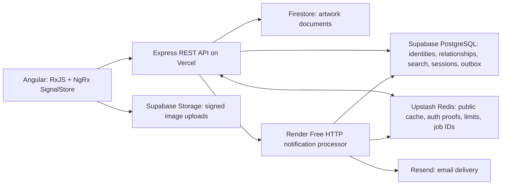

# Atelier — Gallery web app

A full-stack art community built with Angular 21, TypeScript, RxJS, NgRx SignalStore, Node.js 22 and Express 5. Browse and search artwork, save favorites, follow artists, post reviews, publish images, and create or join workshops.

**Live app:** [gallery-web-app-two.vercel.app](https://gallery-web-app-two.vercel.app)

Firestore stores artwork documents. Supabase PostgreSQL stores accounts, relationships and security records; Supabase Storage serves validated images. Upstash Redis caches public data and accelerates durable authorization checks. Angular and Express share one origin on Vercel.


## Run the isolated portfolio demo

Use Node.js **22.14–22.x** and npm:

```sh
npm ci
npm run build
npm run demo
```

Open [localhost:3000](http://localhost:3000). No cloud credentials or external database are required. PGlite runs PostgreSQL in memory; artwork documents use an in-memory adapter and uploads use a temporary directory. This command does not load `.env`. Stop with Ctrl+C; demo changes disappear.

| Account | Username     | Password          |
| ------- | ------------ | ----------------- |
| Patron  | demo         | gallery-demo-2026 |
| Artist  | Maya Laurent | gallery-demo-2026 |

These public credentials work in both the live app and the isolated demo. Shared accounts are for portfolio testing; do not put personal information into them.

The hosted catalog was restored from the original `JSON/` fixtures: 24 artworks by 11 original artists, plus six labeled portfolio samples, the two demo accounts, and one workshop. Six original images were recovered into Supabase Storage. Eighteen unavailable images use sample illustrations with an image note in the artwork description. The old MongoDB server was unreachable, so former user activity was not recovered or invented.

The repeatable operator seed is `node --env-file=.env --import tsx scripts/seed-hosted.ts` with an HTTPS `CLIENT_ORIGIN`. It keeps its prepared snapshot in ignored `exports/hosted-catalog.json`, preserves existing accounts and artwork, and never runs during deployment. Other artist accounts have unknown random passwords; only the two public demo passwords are published.

## Develop against the hosted services

Copy `.env.example` to the ignored `.env` file and configure PostgreSQL, Firestore and Supabase Storage. Keep server credentials outside Angular and Git. Generate a persistent signing secret:

```sh
node -e "console.log(require('node:crypto').randomBytes(32).toString('hex'))"
npm run dev
```

Angular runs at [localhost:4200](http://localhost:4200), proxying `/api` to Express on port 3000. Hosted development uses real data: use separate projects for destructive tests. For a compiled same-origin server, run `npm run build` followed by `npm start`.

## What the project demonstrates

- Angular standalone components, lazy routes, strict templates, reactive forms and responsive layouts.
- RxJS search cancellation/debouncing and NgRx SignalStore authentication state.
- A typed Express REST API with shared contracts, parameterized queries and ownership/role checks.
- Normalized PostgreSQL relationships, foreign keys, transactional counters, GIN full-text search and a serverless transaction pool.
- Firestore document persistence with a SQL publication registry and compensating writes across database boundaries.
- Redis public caching, generation invalidation, concurrent-miss coalescing, distributed throttling and revocation fences.
- Ten-minute JWTs and separate rotating opaque refresh secrets in Strict HttpOnly cookies; hashed refresh storage, CSRF proofs, replay detection and device/session revocation.
- Direct signed image uploads with private staging, MIME/size/signature checks and a 5 MB limit.
- Repeatable migration tooling, an isolated PostgreSQL demo, automated security tests and live cloud verification.

## Design decisions: what goes where, and why

The goal is a responsive application whose correctness survives cache failures and retries. The design keeps business data durable, avoids repeated database reads where safe, and moves email delivery outside HTTP requests. Free hosting influenced the deployment; it does not replace transaction boundaries or security checks.



### Angular, TypeScript and Express

Angular replaces the original Pug views with a routed application: standalone components, lazy-loaded pages, reactive forms, strict template checking and `OnPush` change detection. TypeScript and shared request/response contracts make the frontend/API boundary reviewable. Runtime validation still checks incoming requests; TypeScript types alone cannot validate a network request.

RxJS debounces searches and cancels superseded requests so an old response cannot replace a newer search. NgRx SignalStore holds authentication and gallery state; components derive their views from signals rather than maintaining separate copies of the same data. Pagination limits both the response size and database work. Images load lazily, and layouts adapt to narrow screens.

Express remains the Node.js REST boundary. It owns authentication, authorization, validation and database writes. The frontend never receives PostgreSQL credentials, the Firebase service-account key, Redis credentials or the Resend key. Frontend and API use one Vercel origin, which simplifies cookie handling and avoids an unnecessarily permissive cross-origin configuration.

### Database ownership and consistency

| Store                         | Authoritative data                                                                                                                                                   | Why this choice                                                                                                                                                                               |
| ----------------------------- | -------------------------------------------------------------------------------------------------------------------------------------------------------------------- | --------------------------------------------------------------------------------------------------------------------------------------------------------------------------------------------- |
| Supabase PostgreSQL           | Users/password hashes, likes, follows, reviews, workshops/enrollments, sessions, refresh hashes, token denials, upload reservations, notification preferences/outbox | Relationships benefit from foreign keys, unique constraints and atomic transactions. A duplicate like cannot create a second relationship or increment its counter twice.                     |
| Firestore Standard            | Full artwork documents: identity, artist reference, title, medium, description, image URL                                                                            | Document storage fits artwork content. Its no-billing Spark deployment meets the portfolio budget. Firestore is a different database from MongoDB; Firebase does not host a MongoDB database. |
| PostgreSQL artwork projection | Searchable artwork metadata, description preview, image reference, publication status and aggregate counts                                                           | SQL search and listing avoid scanning Firestore documents or fetching one document per gallery card.                                                                                          |
| Supabase Storage              | Validated image bytes; private upload staging and immutable public images                                                                                            | Large files belong in object storage, not SQL rows, documents or Redis. Signed direct uploads avoid routing image bytes through the Vercel function.                                          |
| Upstash Redis                 | Expiring derived data and queue hints                                                                                                                                | Repeated reads become cheaper, while durable records remain recoverable from their source stores.                                                                                             |

MongoDB is retained in the read-only legacy migration tool. It is **not** an active production database. The original document catalog was normalized into Firestore and PostgreSQL. This demonstrates migration from MongoDB and relational modeling, without claiming the live app runs MongoDB.

An artwork publication crosses two databases, so it cannot be one ACID transaction. The API reserves a SQL record as `pending`, creates its Firestore document, then marks the search projection `published`. Public queries show only published rows. Ambiguous failures preserve documents/images for reconciliation instead of deleting a possibly successful write. Import tooling uses stable IDs and refuses conflicting records; rerunning a seed preserves credentials and prevents duplicates.

PostgreSQL uses parameterized queries, indexed foreign-key access paths, recent/category/artist indexes and a GIN full-text index. Counts update in the same transaction as the relationship they summarize. A transaction-mode Supavisor pool, unnamed queries, a one-connection limit per warm function and timeouts bound connection pressure. Increasing traffic still requires measuring query latency and provider quotas; these choices do not prove unlimited throughput.

### JWT, opaque refresh secret and session ID

| Item                  | Location                                                               | Purpose and lifetime                                                                                                                                                                                                                            |
| --------------------- | ---------------------------------------------------------------------- | ----------------------------------------------------------------------------------------------------------------------------------------------------------------------------------------------------------------------------------------------- |
| Access JWT            | `HttpOnly`, `Secure` production, `SameSite=Strict` cookie              | Signed authentication credential, valid for **10 minutes**. Payload includes user ID (`sub`), non-secret session ID (`sid`) and unique token ID (`jti`). Explicit algorithm, issuer and audience checks prevent accepting the wrong token type. |
| Opaque refresh secret | Separate `HttpOnly`, `Secure`, `Strict` cookie, limited to `/api/auth` | Independent 32-byte random secret. Sent to refresh the access credential; it is rotated on each successful refresh. Only its SHA-256 hash is stored in PostgreSQL.                                                                              |
| Session ID            | PostgreSQL session row, JWT `sid`, derived Redis authorization proofs  | Non-secret identifier for a login/device and its refresh-token family. Knowing it does not authorize refresh or login. Session limits are **7 days idle** and **30 days absolute**. Refresh slides the idle expiry, never the absolute expiry.  |
| Token denial (`jti`)  | PostgreSQL denial row and Redis authorization state                    | Revokes one access token until its expiry, without retaining the raw bearer token. Session revocation invalidates all access credentials for that device.                                                                                       |

A JWT is signed, not encrypted: its header and payload can be decoded. A session identifier in it is safe because it is not the refresh secret. Reusing `sid` as the refresh credential would turn a public identifier into an authentication secret, so the two are generated independently.

On a request, Express verifies the JWT signature and expiry, then checks a short-lived Redis authorization proof. A miss or read outage falls back to PostgreSQL to check session expiry, revocation, token denials and the current account role. JWT-only verification would avoid that lookup but leave a revoked token usable until its ten-minute expiry; this app deliberately pays for the cached security check to support prompt revocation.

Refresh locks the relevant rows, consumes the old hash once, creates a new refresh secret and issues a fresh JWT. Reusing a consumed refresh secret revokes its whole session family. Browser Web Locks coordinate refresh across tabs where supported; the fallback coordinates only within one tab. A stolen valid refresh secret can still be used before replay is detected; rotation mitigates theft rather than making theft impossible.

Redis revocation fences invalidate cached proofs **before** security state changes commit. Epoch checks prevent an in-flight read from restoring an old proof after revocation, and cache eviction does not silently reset revocation authority. When a configured Redis fence cannot be acquired, security-changing requests fail with 503; they do not report success with potentially stale authorization caches. PostgreSQL is the durable home because Redis can expire, evict or lose data.

### Browser and API security

- **Cookie protection:** HttpOnly blocks JavaScript from reading the access/refresh cookies. Secure restricts production transport to HTTPS. SameSite Strict fits the same-origin app; there is no external OAuth login flow requiring a looser cookie policy. Navigation from an external site may initially omit those cookies; subsequent same-origin API requests can establish the authenticated view.
- **CSRF defense:** Strict cookies are paired with signed, session-bound CSRF proofs, Origin checks and Fetch Metadata checks for browser mutations. SameSite alone is not treated as a complete defense, especially for same-site subdomains. The readable XSRF cookie is a request proof, not an authentication credential.
- **XSS mitigation:** Reviews, titles and descriptions are treated as plain text. Angular escapes interpolated output; email templates also encode user-controlled text. Strings containing `<script>` display as text rather than executable markup. Bounds/control-character validation, a CSP restricting scripts to the app, blocked objects/framing and avoiding untrusted `innerHTML` reduce attack surface. HttpOnly does not stop injected JavaScript from making authenticated requests, and no single layer completely prevents XSS.
- **Server checks:** Authentication, role and ownership checks happen in Express. SQL parameters prevent query injection. Passwords use salted scrypt hashes. Distributed rate limits bound general/auth requests; validation and response limits constrain resource use. Internal worker and recovery endpoints use independent server secrets.
- **Files and credentials:** Raster upload MIME, byte length and file signatures are validated with a 5 MB limit. Private staging precedes public promotion. Firestore browser rules deny direct access; the dedicated server identity has narrow IAM permissions. The private SQL schema has RLS and no browser roles. The mail processor uses a separate SQL role and email encryption key; it never receives the JWT signing secret, Firebase key or Supabase storage service key.

### Redis: what is cached and what is not

Public gallery searches/statistics, artwork details and review pages, artist profiles and workshops are cached for **60 seconds** by default. Aggregate like/review counts are part of these cached public responses. Changes invalidate the shared content generation. Generation checks stop a slow pre-invalidation request from filling the current cache with stale data; concurrent misses share one source read within an API instance.

User-specific `liked`, `following`, enrollment and review-ownership flags are overlaid from PostgreSQL after the shared cache read. They are not shared between users. Redis also holds short-lived authorization proofs and distributed rate-limit counters. Raw JWTs, plaintext refresh secrets, password hashes and email bodies are not stored in Redis. Queue entries contain notification UUIDs only.

Public cache failures fall back to SQL/Firestore. Redis is an accelerator, not the authority for likes or comments. A request still writes each like durably; moving these writes into a volatile cache-only buffer would trade correctness for apparent speed.

## Asynchronous email notifications

```mermaid
sequenceDiagram
  participant UI as Angular
  participant API as Express
  participant SQL as PostgreSQL
  participant R as Redis
  participant W as Render processor
  participant E as Resend
  UI->>UI: Optimistically update heart/count
  UI->>API: PUT artwork like
  API->>SQL: Transaction: unique like + count + eligible outbox job
  SQL-->>API: Commit
  API->>R: Invalidate public cache
  API-->>UI: Confirm saved like (roll back UI on failure)
  Note over API,W: Post-response dispatch uses Vercel waitUntil
  API->>R: Enqueue notification UUID
  API->>W: Authenticated wake request
  W->>R: Pop queue hints
  W->>SQL: Lease bounded due jobs; recover expired leases
  W->>SQL: Check consent, verification, suppression and quota
  W->>E: Send frozen payload with stable idempotency key
  E-->>W: Accepted email ID or error
  W->>SQL: Mark done, retry later, or dead-letter
```

The queue makes email asynchronous; **it does not postpone saving likes**. The like and its notification intent commit together in PostgreSQL. This durable outbox closes the gap where a process crashes after saving a like but before enqueueing its notification. If Redis hints disappear, the processor can find pending SQL jobs. Database acknowledgement precedes the HTTP success response; Angular's optimistic heart makes the interaction immediate without misrepresenting durability.

The processor claims jobs with `FOR UPDATE SKIP LOCKED` and expiring leases, so multiple processors can share work and recover a crashed processor's lease. It handles up to five jobs per batch. Transient failures use exponential backoff and jitter; permanent errors become dead letters. Frozen, encrypted email payloads and a stable UUID idempotency key protect retries from changing message contents. Resend retains idempotency keys for 24 hours; automatic uncertain retries stop before that window ends. This is at-least-once processing with bounded provider deduplication, not a claim of universal exactly-once email delivery. See [Resend's idempotency behavior](https://resend.com/docs/dashboard/emails/idempotency-keys).

Notifications require explicit consent and a six-digit email verification code, expiring after 30 minutes and locking after five wrong guesses. Verification requests have a 60-second cooldown and three-per-hour account/address limits. Appreciation notices are limited to one per recipient per hour; they are single notices, not a complete digest of every like. Duplicate likes, self-likes, public demo activity and public demo recipients do not generate email. Users can disable delivery in account settings or through a signed one-click opt-out link. GET links only show a confirmation, so link scanners cannot silently unsubscribe someone.

Signed Resend webhooks verify the exact raw request bytes and deduplicate callbacks before persisting bounce/complaint suppression. Pending jobs recheck preferences/address versions and suppression before sending; an email already accepted by the provider cannot be recalled. Local send-attempt caps are 90/day and 2,700/month, including retries, leaving room below the Free account quotas. Other apps sharing the same Resend account consume that account's limits too.

Render's always-on worker plans cost money. The approved $0 deployment uses a **Render Free HTTP processor**, awakened by real jobs, polling for pending work while awake and stopping cleanly on shutdown. It sleeps when idle and can incur about a minute of cold-start delay. A Vercel Hobby-compatible daily recovery check wakes it only when due SQL jobs exist; it sends no fake keepalive traffic. Email timing is therefore best effort on free hosting. See [Render's free service limits](https://render.com/docs/free).

**Sender setup:** the integration is implemented, but public sending is disabled until an owned domain is verified and the signed webhook is configured. An Outlook mailbox cannot be used as a Resend sender because Microsoft owns that domain. Owner-only tests can use `onboarding@resend.dev` and `RESEND_TEST_RECIPIENT`; they cannot send to other users. See [notification setup and operations](docs/NOTIFICATIONS.md).

The deployed queue/processor/provider path passed both Resend's delivery simulator and one authorized account-owner inbox test, each in one send attempt. Resend reported `delivered` for the simulator and `opened` for the inbox test. Temporary test accounts/jobs were removed, and the processor returned to disabled delivery configuration. The owner's address remains private; public sending still requires the owned-domain setup.

## Configuration and checks

See [.env.example](.env.example) for all variables and [deployment](docs/DEPLOYMENT.md) for the existing cloud resources. Server configuration includes `DATABASE_URL`, the trusted `DATABASE_CA_CERT`, `FIREBASE_PROJECT_ID`, single-quoted serialized `FIREBASE_SERVICE_ACCOUNT_JSON`, `SUPABASE_URL`, `SUPABASE_SERVICE_ROLE_KEY`, and a persistent `JWT_SECRET` of at least 32 random characters.

Use both `UPSTASH_REDIS_REST_URL` and `UPSTASH_REDIS_REST_TOKEN`, or `REDIS_URL` for TCP/TLS Redis. Redis is optional locally. With configured Redis unavailable, public reads fall back to the databases and authorization reads fall back to PostgreSQL. Revocation/refresh writes return 503 if their distributed fence cannot be acquired.

```sh
npm test
npm run build
npm run format:check
npm audit --omit=dev
npm run test:redis
npm run maintenance
```

Live Redis tests require `TEST_REDIS_URL` or `TEST_UPSTASH_REDIS_REST_URL` and `TEST_UPSTASH_REDIS_REST_TOKEN` in ignored `.env.test`. Ordinary tests use isolated in-memory PostgreSQL and cache adapters. Maintenance removes expired security records and up to 100 expired unused uploads; it preserves ambiguous publications for reconciliation.

Verification also covers both hosted demo logins, all 30 image URLs, a repeat seed run, processor endpoint authentication, and the processor SQL role's inability to read users/sessions/refresh records. The Supabase security advisor reported no findings. Unused-index notices on this small new catalog are informational; retain the intended access-path indexes and measure with real traffic before removing them. There is no fabricated large-scale load benchmark.

The production dependency audit reports zero vulnerabilities. The full audit currently reports nine development dependency entries originating from one unpatched `http-cache-semantics` advisory in Angular CLI's package-fetching tools. Do not apply the audit's suggested Angular CLI 7 downgrade. See [the advisory](https://github.com/advisories/GHSA-ch52-4w7c-c8xp).

## Data migration and operating limits

MongoDB is now used only by the explicit legacy exporter, as a development dependency. Existing source data and `uploads/` are preserved. The hosted database is populated from the recovered catalog described above. Migrating additional original activity requires a reachable legacy database and an operator-reviewed snapshot. See [migration and rollback](docs/MIGRATION.md).

This portfolio deployment uses free plans. Free quotas, cold starts, provider outages and inactive-project suspension still apply. Requests are bounded to avoid unnecessary database work; this is not an unlimited-capacity service. Monitor provider dashboards, run maintenance regularly, and keep manual backups. No paid upgrades, Google billing account, Docker or custom CI pipeline are configured.

Read [architecture](docs/ARCHITECTURE.md), [API](docs/API.md), [security](docs/SECURITY.md), [Redis](docs/REDIS.md), [deployment](docs/DEPLOYMENT.md) and [change history](docs/CHANGELOG.md) for details.
