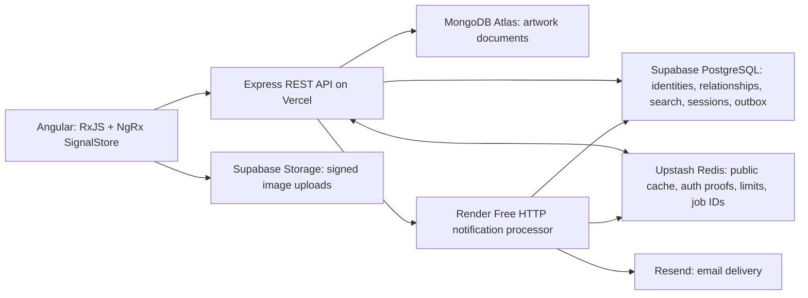
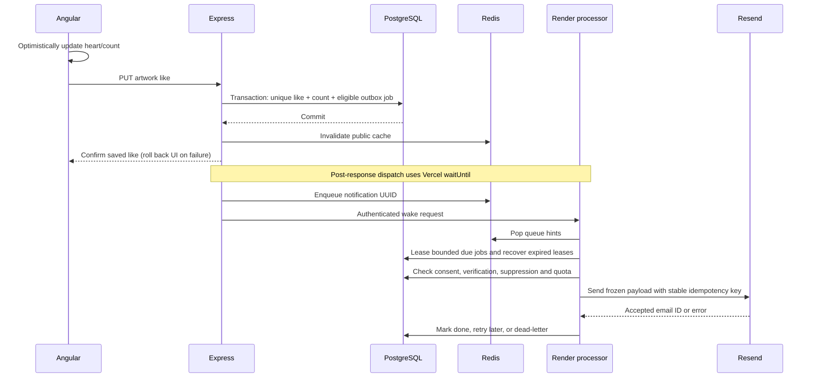

# Atelier — Gallery web app

A full-stack art community built with Angular 21, TypeScript, RxJS, NgRx SignalStore, Node.js 22 and Express 5. Browse and search artwork, save favorites, follow community members, post reviews, publish images, and create or join workshops.

**Live app:** [gallery-web-app-two.vercel.app](https://gallery-web-app-two.vercel.app)

MongoDB Atlas stores artwork documents. Supabase PostgreSQL stores accounts, relationships and security records; Supabase Storage serves validated images. Upstash Redis caches public data and accelerates durable authorization checks. Angular and Express share one origin on Vercel.


## Run the isolated portfolio demo

Use Node.js **22.14–22.x** and npm:

```sh
npm ci
npm run build
npm run demo
```

Open [localhost:3000](http://localhost:3000). No cloud credentials or external database are required. PGlite runs PostgreSQL in memory; artwork documents use an in-memory adapter and uploads use a temporary directory. This command does not load `.env`. Stop with Ctrl+C; demo changes disappear.

| Account | Username     | Password          |
| ------- | ------------ | ----------------- |
| Patron  | demo         | gallery-demo-2026 |
| Artist  | Maya Laurent | gallery-demo-2026 |

These public credentials work in both the live app and the isolated demo. Shared accounts are for portfolio testing; do not put personal information into them.

The hosted catalog preserves the 24 original `JSON/` artwork records and 11 original artist accounts, alongside six demo collection entries, the two demo accounts, and one workshop. Six recovered original images remain in Supabase Storage. Eighteen records with unavailable originals show explicitly labeled, separately credited public-domain **reference images**, not reproductions of the missing works. The six demo entries display actual artwork titles, dates, media and creators from The Met; Maya Laurent is their demo account owner, not their creator. The old MongoDB server was unreachable, so former user activity was not recovered.

A separate, explicitly labeled **fictional community** adds 16 profiles, 24 curated posts, 372 likes, 133 comments and 54 follows, giving 54 hosted posts. Sample usernames end in `(Demo)`, sample comments are labeled, and the footer identifies the demo. The public `demo` patron follows six sample curators, so its Following feed has content. Existing user activity is preserved; these fixtures are not claimed as real customers or recovered historical engagement. See [the repeatable community seed and image privacy notes](docs/DEMO_DATA.md).

The landing page, sign-in page and demo collection use real artwork from [The Met Open Access collection](https://www.metmuseum.org/hubs/open-access). Twenty-four CC0 JPEGs are bundled with source links and SHA-256 digests; none were sourced from private computer photos. Restored originals came from public fixture URLs. Vercel serves bundled assets through its CDN; normal user uploads continue to use Supabase Storage. Images load lazily outside the hero, and consistent inline SVG icons replace emoji and decorative text symbols. See [image credits and the repeatable catalog repair](docs/ARTWORK_IMAGES.md).

The repeatable operator seed is `node --env-file=.env --import tsx scripts/seed-hosted.ts` with an HTTPS `CLIENT_ORIGIN`. It keeps its prepared snapshot in ignored `exports/hosted-catalog.json`, preserves existing accounts and artwork, and never runs during deployment. Other artist accounts have unknown random passwords; only the two public demo passwords are published.

## Develop against the hosted services

Copy `.env.example` to the ignored `.env` file and configure MongoDB, PostgreSQL and Supabase Storage. Keep server credentials outside Angular and Git. Run `npm run mongo:prepare` once to create/verify the artwork collection's validator. Generate a persistent signing secret:

```sh
node -e "console.log(require('node:crypto').randomBytes(32).toString('hex'))"
npm run dev
```

Angular runs at [localhost:4200](http://localhost:4200), proxying `/api` to Express on port 3000. Hosted development uses real data: use separate projects for destructive tests. For a compiled same-origin server, run `npm run build` followed by `npm start`.

## What the project demonstrates

- Angular standalone components, lazy routes, strict templates, reactive forms and responsive layouts.
- RxJS search cancellation/debouncing and NgRx SignalStore authentication state.
- A typed Express REST API with shared contracts, parameterized queries and ownership/role checks.
- Normalized PostgreSQL relationships, foreign keys, transactional counters, GIN full-text search and a serverless transaction pool.
- MongoDB document persistence with database schema validation, unique artwork IDs, a SQL publication registry and compensating writes across database boundaries.
- Redis public caching, generation invalidation, concurrent-miss coalescing, distributed throttling and revocation fences.
- Ten-minute JWTs and separate rotating opaque refresh secrets in Strict HttpOnly cookies; hashed refresh storage, CSRF proofs, replay detection and device/session revocation.
- Direct signed image uploads with private staging, MIME/size/signature checks and a 5 MB limit.
- Repeatable migration tooling, an isolated PostgreSQL demo, automated security tests and live cloud verification.
- Email-based registration, verified-email recovery, notification opt-out, password-confirmed export and retryable account deletion.
- GitHub Actions quality checks and staged deployment, with production credentials excluded from pull-request jobs.

## Engineering practices and evidence

Built around established web application engineering practices, with reviewable implementation and explicit operating limits. This demonstrates practical full-stack engineering; it is not a universal certification or an unlimited-scale claim.

| Capability                         | Concrete evidence                                                                                             |
| ---------------------------------- | ------------------------------------------------------------------------------------------------------------- |
| Angular / RxJS / NgRx              | Lazy standalone routes, reactive forms, SignalStore and cancellation of outdated searches                     |
| Node.js / Express / TypeScript     | Typed REST contracts, runtime validation and server-side ownership/role checks                                |
| MongoDB / PostgreSQL               | Validated documents, normalized relationships, indexed discovery, transactions and publication reconciliation |
| Redis / asynchronous work          | Public cache isolation, revocation fences, throttling and SQL-backed notification outbox                      |
| Authentication / account lifecycle | Strict HttpOnly JWT/opaque refresh cookies, single-use recovery, session revocation and email consent         |
| Privacy controls                   | Public notices, versioned acknowledgement, password-confirmed export/deletion and retention                   |
| Cloud delivery / storage           | Vercel CDN, private signed staging, durable object storage and separate Render processor                      |
| Docker / quality / delivery        | Docker Redis service container, real database integration tests, builds, formatting and gated CI/CD           |

The [37-area engineering checklist](docs/APP_STANDARDS.md) maps every requested area to evidence and remaining work. Formal accessibility/legal review, dedicated alerts, automated backups and advanced SEO remain improvements. See [account lifecycle](docs/ACCOUNT_LIFECYCLE.md), [CI/CD](docs/CI_CD.md) and [technical legal readiness](docs/LEGAL_REVIEW.md).

**CI/CD status:** the [verified automatic release](https://github.com/khalifehbasiri/Gallery-web-app/actions/runs/37231980502) passed 78 backend and 17 Angular tests, formatting, production builds and the runtime dependency audit, then staged/smoke-tested/promoted the Vercel release and triggered Render for the same tested commit. Vercel token permissions and explicit team scope are checked/configured; Render Auto-Deploy is Off so releases use the gated hook. GitHub Actions use Node 24 internally while the app stays on Node 22. See [deployment setup, test coverage and everyday workflow usage](docs/CI_CD.md).

### Account email, recovery and privacy

Signup requires a private email and terms acknowledgement; notification consent is separate and unchecked by default. Existing users can add an email after password confirmation. Verification enables recovery; optional notifications can be disabled or re-enabled independently. Shared demos cannot store private email, reset passwords or be deleted.

Password reset uses a separate random 32-byte secret. PostgreSQL stores its SHA-256 hash; a 30-minute single-use challenge and encrypted delivery job commit together. The email fragment is removed by Angular before a CSRF-protected POST. Reset replaces the scrypt hash, consumes challenges and revokes all sessions through the Redis fence, then requires login. Unknown addresses receive the same request response. Sender configuration is still required for real delivery.

Account settings offer password-confirmed JSON export and deletion. Deletion immediately retires access and hides public entries, then leases/checkpoints MongoDB, Storage and SQL cleanup. Failed cleanup is retried, including a final image sweep after signed upload links expire. Daily maintenance enforces retention windows. Historical snapshots/provider backups still need operator handling; a qualified legal review is pending. [Details and limits](docs/ACCOUNT_LIFECYCLE.md).

### CDN and object storage

The app already uses both: **object storage keeps image bytes durably; a CDN delivers assets nearer to visitors**. Vercel supplies the frontend CDN. Supabase Storage holds private staging and public images, whose URLs benefit from its CDN. Immutable paths avoid overwriting cached images; new uploads use a one-hour cache lifetime to reduce removal latency. API responses remain `private, no-store`, with application caching in Redis. No additional CDN/storage subscription is needed. See [Supabase asset delivery](https://supabase.com/docs/guides/storage/serving/downloads).

### CI/CD

Pull requests/main pushes run installation, formatting, API/Angular tests, production build and a high/critical runtime audit. CI uses isolated SQL/MongoDB and runner-local Redis, without production database/email credentials. Main releases stage a prebuilt Vercel artifact, smoke-check it and promote that artifact; a Render hook deploys the tested revision. Vercel automatic Git deployment is disabled to prevent bypassing checks. Deployment secrets and Gallery's Render Auto-Deploy Off setting are configured; missing credentials or failed permission checks stop a release explicitly. [Pipeline setup and verification](docs/CI_CD.md).

### Docker: isolated Redis integration tests

Docker runs software in containers: isolated processes created from an **image**, a packaged filesystem containing the software and its dependencies. Containers share the host kernel; they do not each boot a complete virtual machine. This project uses the published `redis:7.4.2` image in [the GitHub Actions workflow](.github/workflows/ci.yml), with a fixed version tag for consistent integration tests. The tag is not a cryptographic image digest. See [Docker's overview](https://docs.docker.com/get-started/docker-overview/).

The pipeline uses Docker as follows:

1. GitHub creates an Ubuntu runner and a fresh Redis service container for the quality job.
2. A `redis-cli ping` health check confirms readiness; port `6379` connects the runner's Node.js tests to `TEST_REDIS_URL=redis://127.0.0.1:6379`.
3. Integration tests exercise real Redis cache expiry/invalidation, authorization revocation fences and deduplicated notification queue consumption. SQL uses PGlite; MongoDB tests start a temporary MongoDB binary separately.
4. GitHub removes the Redis container after the job, including failed jobs. Test data is disposable; no production Redis credentials are used.
5. Only a passing main revision proceeds to Vercel staging/smoke checks/promotion and the Render deploy hook. Docker supplies a test dependency; GitHub Actions controls the release gate. See [GitHub service containers](https://docs.github.com/en/actions/tutorials/use-containerized-services/use-docker-service-containers).

The application is deployed through Vercel's build output and Render's Node.js runtime. This repository has no application Dockerfile, Compose stack or image-registry release. Docker is not required to run the isolated portfolio demo. The demonstrated Docker skill is configuring disposable CI service containers and testing real dependency behavior.

At larger companies, a common additional pattern is to build an application image from a Dockerfile, test and scan it in CI, publish it to a registry, and deploy that exact image digest through staging and production. This makes the application package consistent across environments and identifies a previous image for rollback. Orchestrators such as Kubernetes manage replicas and rolling updates; database durability, resource limits and load testing still require separate design. That is a potential future deployment model, beyond this project's current Docker use. See [Docker's CI tooling](https://docs.docker.com/build/ci/github-actions/) and [Kubernetes deployments](https://kubernetes.io/docs/concepts/workloads/controllers/deployment/).

### Following and Explore feeds

Members of either role can find and follow each other on [People](https://gallery-web-app-two.vercel.app/people). [Following](https://gallery-web-app-two.vercel.app/following) shows their newest published posts, or random discoveries when there are no follows. [Explore](https://gallery-web-app-two.vercel.app/explore) uses a random starting point in an indexed shuffled order. Both use signed cursor pagination and cancel stale client requests.

After durable publication, a deferred task refreshes a bounded Redis pool of recent public summaries. Cached viewer-specific selections and indexed SQL fallback keep older followed posts accessible without querying feed content on every visit. Personal like flags remain a separate bounded SQL lookup. This avoids copying every post into every follower’s cache. [Feed design, tests and improvements](docs/FEEDS.md).

## Design decisions: what goes where, and why

The goal is a responsive application whose correctness survives cache failures and retries. The design keeps business data durable, avoids repeated database reads where safe, and moves email delivery outside HTTP requests. Free hosting influenced the deployment; it does not replace transaction boundaries or security checks.



### Angular, TypeScript and Express

Angular replaces the original Pug views with a routed application: standalone components, lazy-loaded pages, reactive forms, strict template checking and `OnPush` change detection. TypeScript and shared request/response contracts make the frontend/API boundary reviewable. Runtime validation still checks incoming requests; TypeScript types alone cannot validate a network request.

RxJS debounces searches and cancels superseded requests so an old response cannot replace a newer search. NgRx SignalStore holds authentication and gallery state; components derive their views from signals rather than maintaining separate copies of the same data. Pagination limits both the response size and database work. Images load lazily, and layouts adapt to narrow screens.

Express remains the Node.js REST boundary. It owns authentication, authorization, validation and database writes. The frontend never receives MongoDB or PostgreSQL credentials, Redis credentials or the Resend key. Frontend and API use one Vercel origin, which simplifies cookie handling and avoids an unnecessarily permissive cross-origin configuration.

### Database ownership and consistency

| Store                         | Authoritative data                                                                                                                                                   | Why this choice                                                                                                                                                                          |
| ----------------------------- | -------------------------------------------------------------------------------------------------------------------------------------------------------------------- | ---------------------------------------------------------------------------------------------------------------------------------------------------------------------------------------- |
| Supabase PostgreSQL           | Users/password hashes, likes, follows, reviews, workshops/enrollments, sessions, refresh hashes, token denials, upload reservations, notification preferences/outbox | Relationships benefit from foreign keys, unique constraints and atomic transactions. A duplicate like cannot create a second relationship or increment its counter twice.                |
| MongoDB Atlas Free            | Full artwork documents: identity, artist reference, title, medium, description, image URL                                                                            | Document storage fits artwork content; strict JSON Schema validation constrains shape/types. The Free M0 cluster meets the portfolio budget and demonstrates active MongoDB integration. |
| PostgreSQL artwork projection | Searchable artwork metadata, description preview, image reference, publication status and aggregate counts                                                           | SQL search and listing avoid scanning MongoDB documents or fetching one document per gallery card.                                                                                       |
| Supabase Storage              | Validated image bytes; private upload staging and immutable public images                                                                                            | Large files belong in object storage, not SQL rows, documents or Redis. Signed direct uploads avoid routing image bytes through the Vercel function.                                     |
| Upstash Redis                 | Expiring derived data and queue hints                                                                                                                                | Repeated reads become cheaper, while durable records remain recoverable from their source stores.                                                                                        |

MongoDB is the active non-relational database. Each document uses its original artwork ID as the unique, indexed `_id`; the API translates it back to the shared `id` contract. Descriptions stay intact, image bytes stay in Storage, and accounts/likes/comments remain in PostgreSQL. The native Node.js MongoDB driver reuses one client per warm API instance, with at most three pooled connections per server, zero minimum idle connections, 30-second idle expiry and bounded selection/operation/wait times. Monitoring sockets are additional, so the pool cap is not a total application connection cap. These choices limit connection growth on serverless hosting; they do not remove Atlas's free-tier capacity limits. See [MongoDB connection pooling](https://www.mongodb.com/docs/drivers/node/current/connect/connection-options/connection-pools/).

All 30 hosted artwork documents were copied from Firestore and verified field by field against the retained snapshot and existing SQL projections. IDs, demo credentials, likes, comments, sessions and image URLs were preserved. Firestore remains a retained migration source; the optional adapter is selected only by an explicit `ARTWORK_BACKEND=firestore` rollback configuration. A MongoDB failure never silently switches stores. See [the cutover and rollback procedure](docs/MIGRATION.md).

An artwork publication crosses two databases, so it cannot be one ACID transaction. The API reserves a SQL record as `pending`, creates its MongoDB document with majority write acknowledgement, then marks the search projection `published`. Public queries show only published rows. Ambiguous failures preserve documents/images for reconciliation instead of deleting a possibly successful write. Import tooling uses stable IDs and refuses conflicting records; rerunning a seed preserves credentials and prevents duplicates.

PostgreSQL uses parameterized queries, indexed foreign-key access paths, recent/category/artist indexes and a GIN full-text index. Counts update in the same transaction as the relationship they summarize. A transaction-mode Supavisor pool, unnamed queries, a one-connection limit per warm function and timeouts bound connection pressure. Increasing traffic still requires measuring query latency and provider quotas; these choices do not prove unlimited throughput.

### JWT, opaque refresh secret and session ID

| Item                  | Location                                                               | Purpose and lifetime                                                                                                                                                                                                                            |
| --------------------- | ---------------------------------------------------------------------- | ----------------------------------------------------------------------------------------------------------------------------------------------------------------------------------------------------------------------------------------------- |
| Access JWT            | `HttpOnly`, `Secure` production, `SameSite=Strict` cookie              | Signed authentication credential, valid for **10 minutes**. Payload includes user ID (`sub`), non-secret session ID (`sid`) and unique token ID (`jti`). Explicit algorithm, issuer and audience checks prevent accepting the wrong token type. |
| Opaque refresh secret | Separate `HttpOnly`, `Secure`, `Strict` cookie, limited to `/api/auth` | Independent 32-byte random secret. Sent to refresh the access credential; it is rotated on each successful refresh. Only its SHA-256 hash is stored in PostgreSQL.                                                                              |
| Session ID            | PostgreSQL session row, JWT `sid`, derived Redis authorization proofs  | Non-secret identifier for a login/device and its refresh-token family. Knowing it does not authorize refresh or login. Session limits are **7 days idle** and **30 days absolute**. Refresh slides the idle expiry, never the absolute expiry.  |
| Token denial (`jti`)  | PostgreSQL denial row and Redis authorization state                    | Revokes one access token until its expiry, without retaining the raw bearer token. Session revocation invalidates all access credentials for that device.                                                                                       |

A JWT is signed, not encrypted: its header and payload can be decoded. A session identifier in it is safe because it is not the refresh secret. Reusing `sid` as the refresh credential would turn a public identifier into an authentication secret, so the two are generated independently.

On a request, Express verifies the JWT signature and expiry, then checks a short-lived Redis authorization proof. A miss or read outage falls back to PostgreSQL to check session expiry, revocation, token denials and the current account role. JWT-only verification would avoid that lookup but leave a revoked token usable until its ten-minute expiry; this app deliberately pays for the cached security check to support prompt revocation.

Refresh locks the relevant rows, consumes the old hash once, creates a new refresh secret and issues a fresh JWT. Reusing a consumed refresh secret revokes its whole session family. Browser Web Locks coordinate refresh across tabs where supported; the fallback coordinates only within one tab. A stolen valid refresh secret can still be used before replay is detected; rotation mitigates theft rather than making theft impossible.

Redis revocation fences invalidate cached proofs **before** security state changes commit. Epoch checks prevent an in-flight read from restoring an old proof after revocation, and cache eviction does not silently reset revocation authority. When a configured Redis fence cannot be acquired, security-changing requests fail with 503; they do not report success with potentially stale authorization caches. PostgreSQL is the durable home because Redis can expire, evict or lose data.

### Browser and API security

- **Cookie protection:** HttpOnly blocks JavaScript from reading the access/refresh cookies. Secure restricts production transport to HTTPS. SameSite Strict fits the same-origin app; there is no external OAuth login flow requiring a looser cookie policy. Navigation from an external site may initially omit those cookies; subsequent same-origin API requests can establish the authenticated view.
- **CSRF defense:** Strict cookies are paired with signed, session-bound CSRF proofs, Origin checks and Fetch Metadata checks for browser mutations. SameSite alone is not treated as a complete defense, especially for same-site subdomains. The readable XSRF cookie is a request proof, not an authentication credential.
- **XSS mitigation:** Reviews, titles and descriptions are treated as plain text. Angular escapes interpolated output; email templates also encode user-controlled text. Strings containing `<script>` display as text rather than executable markup. Bounds/control-character validation, a CSP restricting scripts to the app, blocked objects/framing and avoiding untrusted `innerHTML` reduce attack surface. HttpOnly does not stop injected JavaScript from making authenticated requests, and no single layer completely prevents XSS.
- **Server checks:** Authentication, role and ownership checks happen in Express. SQL parameters prevent query injection. Passwords use salted scrypt hashes. Distributed rate limits bound general/auth requests; validation and response limits constrain resource use. Internal worker and recovery endpoints use independent server secrets.
- **Files and credentials:** Raster upload MIME, byte length and file signatures are validated with a 5 MB limit. Private staging precedes public promotion. MongoDB requires verified TLS and a database user restricted to Gallery's database/cluster; Express enforces ownership. The private SQL schema has RLS and no browser roles. The mail processor uses a separate SQL role and email encryption key; it never receives the JWT signing secret, MongoDB credentials or Supabase storage service key. Vercel Hobby has varying outbound IPs, so the dedicated Atlas project uses a broad network allowlist; this is a free-hosting tradeoff, not private-network isolation.

### Redis: what is cached and what is not

Public gallery searches/statistics, artwork details and review pages, artist profiles and workshops are cached for **60 seconds** by default. Aggregate like/review counts are part of these cached public responses. Changes invalidate the shared content generation. Generation checks stop a slow pre-invalidation request from filling the current cache with stale data; concurrent misses share one source read within an API instance.

User-specific `liked`, `following`, enrollment and review-ownership flags are overlaid from PostgreSQL after the shared cache read. They are not shared between users. Redis also holds short-lived authorization proofs and distributed rate-limit counters. Raw JWTs, plaintext refresh secrets, password hashes and email bodies are not stored in Redis. Queue entries contain notification UUIDs only.

Public cache failures fall back to SQL/MongoDB. Redis is an accelerator, not the authority for likes or comments. A request still writes each like durably; moving these writes into a volatile cache-only buffer would trade correctness for apparent speed. A stable `REDIS_SCOPE_ID` keeps cached authorization and notification scheduling in the same namespace through the database switch; both API and processor share it.

## Asynchronous email notifications



The queue makes email asynchronous; **it does not postpone saving likes**. The like and its notification intent commit together in PostgreSQL. This durable outbox closes the gap where a process crashes after saving a like but before enqueueing its notification. If Redis hints disappear, the processor can find pending SQL jobs. Database acknowledgement precedes the HTTP success response; Angular's optimistic heart makes the interaction immediate without misrepresenting durability.

The processor claims jobs with `FOR UPDATE SKIP LOCKED` and expiring leases, so multiple processors can share work and recover a crashed processor's lease. It handles up to five jobs per batch. Transient failures use exponential backoff and jitter; permanent errors become dead letters. Frozen, encrypted email payloads and a stable UUID idempotency key protect retries from changing message contents. Resend retains idempotency keys for 24 hours; automatic uncertain retries stop before that window ends. This is at-least-once processing with bounded provider deduplication, not a claim of universal exactly-once email delivery. See [Resend's idempotency behavior](https://resend.com/docs/dashboard/emails/idempotency-keys).

Notifications require explicit consent and a six-digit email verification code, expiring after 30 minutes and locking after five wrong guesses. Verification requests have a 60-second cooldown and three-per-hour account/address limits. Appreciation notices are limited to one per recipient per hour; they are single notices, not a complete digest of every like. Duplicate likes, self-likes, public demo activity and public demo recipients do not generate email. Users can disable delivery in account settings or through a signed one-click opt-out link. GET links only show a confirmation, so link scanners cannot silently unsubscribe someone.

Signed Resend webhooks verify the exact raw request bytes and deduplicate callbacks before persisting bounce/complaint suppression. Pending jobs recheck preferences/address versions and suppression before sending; an email already accepted by the provider cannot be recalled. Local send-attempt caps are 90/day and 2,700/month, including retries, leaving room below the Free account quotas. Other apps sharing the same Resend account consume that account's limits too.

Render's always-on worker plans cost money. The approved $0 deployment uses a **Render Free HTTP processor**, awakened by real jobs, polling for pending work while awake and stopping cleanly on shutdown. It sleeps when idle and can incur about a minute of cold-start delay. A Vercel Hobby-compatible daily recovery check wakes it only when due SQL jobs exist; it sends no fake keepalive traffic. Email timing is therefore best effort on free hosting. See [Render's free service limits](https://render.com/docs/free).

**Sender setup:** the integration is implemented, but public sending is disabled until an owned domain is verified and the signed webhook is configured. An Outlook mailbox cannot be used as a Resend sender because Microsoft owns that domain. Owner-only tests can use `onboarding@resend.dev` and `RESEND_TEST_RECIPIENT`; they cannot send to other users. See [notification setup and operations](docs/NOTIFICATIONS.md).

The deployed queue/processor/provider path passed both Resend's delivery simulator and one authorized account-owner inbox test, each in one send attempt. Resend reported `delivered` for the simulator and `opened` for the inbox test. Temporary test accounts/jobs were removed, and the processor returned to disabled delivery configuration. The owner's address remains private; public sending still requires the owned-domain setup.

## Configuration and checks

See [.env.example](.env.example) for all variables and [deployment](docs/DEPLOYMENT.md) for the existing cloud resources. Server configuration includes `MONGODB_URI`, `MONGODB_DATABASE=gallery`, `ARTWORK_BACKEND=mongodb`, `DATABASE_URL`, the trusted `DATABASE_CA_CERT`, `SUPABASE_URL`, `SUPABASE_SERVICE_ROLE_KEY`, and a persistent `JWT_SECRET` of at least 32 random characters. Firebase credentials are retained locally only for deliberate export/rollback operations.

Use both `UPSTASH_REDIS_REST_URL` and `UPSTASH_REDIS_REST_TOKEN`, or `REDIS_URL` for TCP/TLS Redis. Redis is optional locally. With configured Redis unavailable, public reads fall back to the databases and authorization reads fall back to PostgreSQL. Revocation/refresh writes return 503 if their distributed fence cannot be acquired.

```sh
npm test
npm run build
npm run format:check
npm audit --omit=dev
npm run test:redis
npm run maintenance
```

Live Redis tests require `TEST_REDIS_URL` or `TEST_UPSTASH_REDIS_REST_URL` and `TEST_UPSTASH_REDIS_REST_TOKEN` in ignored `.env.test`. Ordinary tests use isolated in-memory PostgreSQL and cache adapters. Maintenance removes expired security records and bounded expired unused uploads; it preserves ambiguous publications for reconciliation.

Community seeding is covered by repeat-run, preservation, conflict, rollback, counter and publication-recovery tests. The current suite has 78 backend and 17 Angular tests. Hosted checks verified all 54 posts, their 30 distinct audited public-source images, sample engagement counts, and unchanged existing accounts/content/activity and notification outbox. Desktop and mobile browser checks confirmed readable credits/comments, a populated Following feed, no broken images and no horizontal overflow. See [demo dataset verification](docs/DEMO_DATA.md).

Verification also covers both hosted demo logins, all 30 image URLs, a repeat seed run, processor endpoint authentication, and the processor SQL role's inability to read users/sessions/refresh records. The Supabase security advisor reported no findings. Unused-index notices on this small new catalog are informational; retain the intended access-path indexes and measure with real traffic before removing them. There is no fabricated large-scale load benchmark.

The production dependency audit reports zero vulnerabilities. The full audit currently reports nine development dependency entries originating from one unpatched `http-cache-semantics` advisory in Angular CLI's package-fetching tools. Do not apply the audit's suggested Angular CLI 7 downgrade. See [the advisory](https://github.com/advisories/GHSA-ch52-4w7c-c8xp).

## Data migration and operating limits

The live API uses the native MongoDB driver. Mongoose remains a development dependency for the explicit read-only legacy exporter. Existing source data and `uploads/` are preserved. The hosted database is populated from the recovered catalog described above. Migrating additional original activity requires a reachable legacy database and an operator-reviewed snapshot. Tests use a real temporary MongoDB 8 server; its binary downloads on the first test run, not during production installation. See [migration and rollback](docs/MIGRATION.md).

This portfolio deployment uses free plans. Free quotas, cold starts, provider outages and inactive-project suspension still apply. Requests are bounded to avoid unnecessary database work; this is not an unlimited-capacity service. Monitor provider dashboards, run maintenance regularly, and keep manual backups. No paid upgrades, Google billing account or Docker application hosting are configured. The GitHub Actions pipeline is documented above.

Read [architecture](docs/ARCHITECTURE.md), [API](docs/API.md), [security](docs/SECURITY.md), [Redis](docs/REDIS.md), [deployment](docs/DEPLOYMENT.md) and [change history](docs/CHANGELOG.md) for details.
