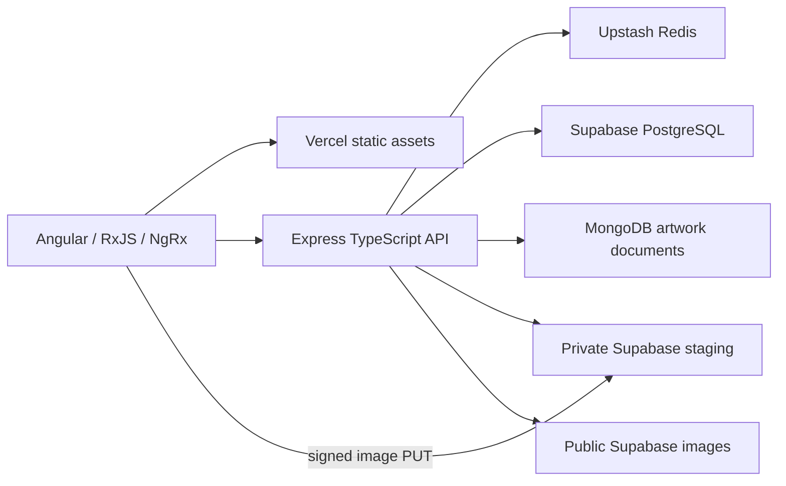

# Architecture

Angular and Express share a Vercel origin. Static assets use the CDN; `api/index.ts` reuses SDK clients and a one-connection PostgreSQL pool in each warm function. The local server uses the same Express app.

| Store                             | Authoritative records                                                                                                               |
| --------------------------------- | ----------------------------------------------------------------------------------------------------------------------------------- |
| MongoDB Atlas Free                | Artwork documents, including full descriptions; unique indexed `_id` and strict schema validation                                   |
| PostgreSQL private gallery schema | Users, credentials, sessions, refresh digests, JWT denials, likes, follows, reviews, workshops, enrollments and upload reservations |
| Supabase Storage                  | Image bytes                                                                                                                         |
| Redis                             | Expiring public content and authorization proofs; never the durable source                                                          |

PostgreSQL also stores an artwork search/publication projection: title, category, medium, year, a 280-character description preview, image reference, publication state, counters and a GIN-indexed full-text vector. Detail reads fetch MongoDB by ID; search queries SQL rather than scanning document collections. The native MongoDB driver reuses one client per warm runtime with a three-connection pool per server, additional monitoring sockets, zero minimum idle connections, 30-second idle expiry and bounded waits/operations. Writes request majority acknowledgement; runtime requests never alter collection validators.

## Consistency and scaling

Likes/reviews lock the artwork row and update relationships/counters in one transaction. Unique composite keys make repeated likes, follows and enrollments safe. Personal liked/joined/owned flags are overlaid after loading public cache entries, using bounded SQL queries. The People directory overlays following state from a viewer-scoped cached graph. Members of either role can follow each other. Feeds use a shared bounded recent pool, cached personalized selection, indexed older-post fallback and signed keyset cursors; publication proactively warms the pool. See [feeds](FEEDS.md).

Gallery/workshop/review pages accept at most 48 items and page 500. Account/artist sections cap at 48 entries; session lists at 100. Larger catalogs need cursor pagination and independently paginated account sections. Indexes cover foreign keys, recent lists, filters, reviews, text search and expiry cleanup. Transaction-pool connections use unnamed statements, five-second statement/connection timeouts and one socket per warm function.

Publication reserves SQL status `pending`, creates a MongoDB document, then sets `published`. Pending rows are invisible publicly. Timed-out writes are reconciled before compensation; unresolved states preserve resources for operator repair. A completed publication can be retried with the same upload ID and metadata. Concurrent claims are atomic; failed consumed reservations require reconciliation or a new upload. There is no transaction spanning both databases and image storage.

Images bypass Vercel's function request-size cap. Signed PUTs target a private bucket. Publication checks owner, expiry, exact bytes, MIME type and signature before promotion to an immutable public path. Limits are 5 MB/image and ten reservations/account per 15 minutes, enforced under a SQL lock.

Redis limits traffic to 120 API requests/minute per HMAC-hashed IP and 30 login/register/refresh attempts per 15 minutes. Local limits remain during Redis outages but are weaker across multiple instances. Provider quotas remain necessary; content-cache failure transfers work to database quotas. No plan upgrades occur automatically.

## Local adapters

The credential-free demo uses PGlite, an in-memory document adapter and temporary uploads. API/migration tests exercise isolated PostgreSQL semantics. Production requires cloud configuration and never substitutes demo data.

Mongoose remains only for read-only legacy export; production uses the native MongoDB driver. [Migration](MIGRATION.md) preserves IDs, hashes credentials, normalizes relationships, copies assets and verifies records. The Firestore-to-MongoDB cutover transfers artwork documents only, preserving the existing SQL accounts, sessions and relationships. `ARTWORK_WRITES_PAUSED` gates publication during migration; an explicit Firestore adapter supports controlled rollback, with no automatic failover. `REDIS_SCOPE_ID` preserves the existing shared authorization/queue namespace. See [security](SECURITY.md), [Redis](REDIS.md) and [deployment](DEPLOYMENT.md).

# Notification extension

Like persistence remains synchronous and transactional. An eligible email event is inserted into the PostgreSQL outbox in that same transaction. Redis stores event UUID hints after commit; a Render Free HTTP processor leases SQL jobs, checks consent/suppression/budget and sends through Resend. No email or refresh secret is stored in Redis. The mail processor has a restricted SQL role and a separate payload-encryption key, and receives no JWT signing or artwork-storage secrets. See [notification design and operations](NOTIFICATIONS.md) and the expanded [README](../README.md).

Account verification and recovery share the durable encrypted outbox with challenge-specific eligibility independent of optional consent. A separate SQL deletion manifest leases/checkpoints MongoDB/Storage removals after immediate retirement; daily maintenance retries it and expires security/mail records. See [account lifecycle](ACCOUNT_LIFECYCLE.md) and [CI/CD](CI_CD.md).
