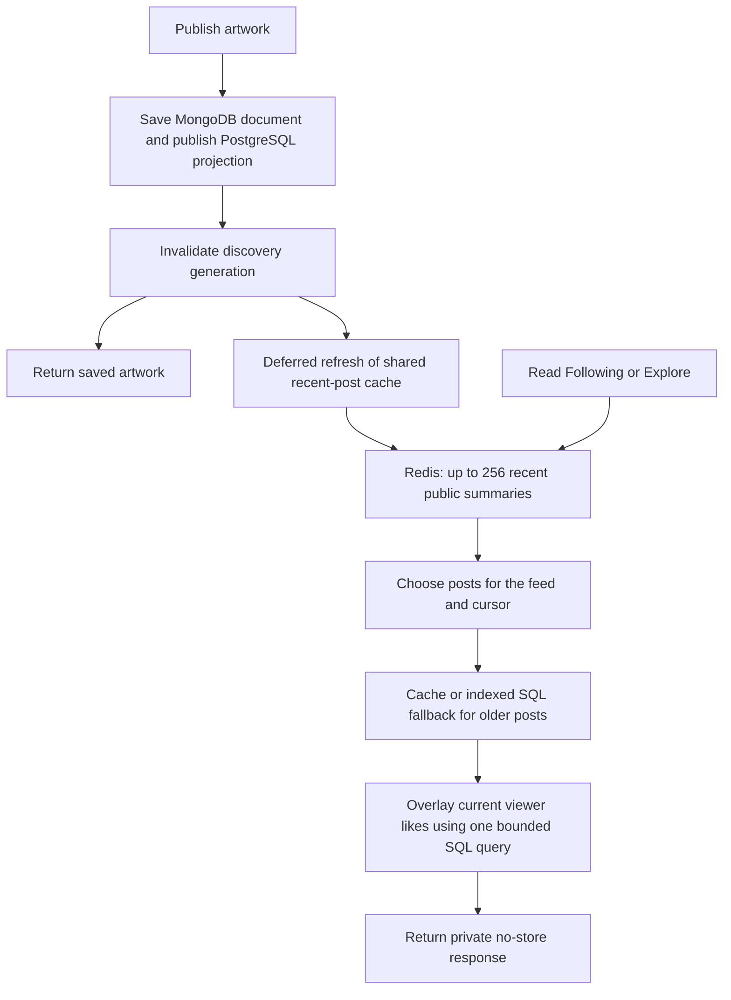

# Community follows and artwork feeds

`/people` lists public usernames/roles and links to profiles. Artists and patrons can follow each other; self-follows are rejected. A unique SQL key makes repeated follow/unfollow requests idempotent. The historical `follows.artist_id` column now means the followed account ID, preserving existing relationships. Publication remains an artist capability. Active-account checks, CSRF, ordered SQL locks and a 1,000-follow limit protect the portfolio's bounded workload.

## Feed behavior

- **Following** requires login and returns published artwork from followed accounts, newest first, with ID as the tie breaker. Following someone who has no posts yields an empty Following feed. If there are no follows, it explicitly displays random discoveries instead.
- **Explore** is public and starts at a random point in an indexed, persistently shuffled artwork order. Refresh chooses a new starting point. This is random discovery, not a relevance model or a promise of uniformly sampled independent posts.
- Both use **cursor pagination**, 12 items in the UI and at most 48 per API request. Signed cursors expire after one hour and carry a timestamp cutoff and last position. Exact PostgreSQL microseconds are preserved. New posts do not shift subsequent pages; deletion can remove items. A Following cursor is bound to its viewer and follow graph. Account/follow changes require a refresh (409).

Explore stores `md5(artwork_id)` as a generated ordering key and indexes `(explore_key,id)` for published rows. MD5 serves only as a shuffled sort key. The query seeks forward from a random pivot, then wraps once, rather than sorting the entire catalog with `ORDER BY random()` or using increasingly deep offsets. Planner choices still depend on table size and data distribution; there is no large-scale benchmark claim. [PostgreSQL ordering/index guidance](https://www.postgresql.org/docs/current/indexes-ordering.html).

## Cache design and durability

The database acknowledges publication before success. The post-response task uses the existing Vercel `waitUntil` boundary to populate Redis from the canonical published projection. Warming is best effort: a crash, quota or Redis outage cannot lose the saved post; a later read rebuilds the pool. Failed invalidation can leave content stale until its configured TTL, normally 60 seconds. This is not a transactional database/cache write or guaranteed real-time delivery.

Redis holds a **bounded shared pool of 256 public summaries**, not every follower's copy of each post. It omits full MongoDB descriptions and SQL search vectors. The pool records whether it covers the whole catalog. Following filters it in memory when coverage is sufficient. Otherwise an indexed SQL query retrieves older matching posts; that page is cached with a viewer/follow-context key. Follow IDs are cached under the viewer's ID. These user-scoped cache entries contain selection/relationship IDs, never bearer credentials or email.

A complete small catalog can supply Explore locally from the shared pool, avoiding a new Redis page entry for every random seed. Larger catalogs use bounded SQL range seeks, with cached selection pages. Older posts are not silently dropped when the recent window fills.

Personal `liked` flags are **not stored in shared entries**. Authenticated responses run one bounded, indexed likes lookup for the shown IDs. Authentication also uses the existing Redis proof/session fallback protocol. Therefore caching avoids repeated feed-content queries, but does not claim that every authenticated request requires zero PostgreSQL access.

Publication, follow changes, likes/reviews, role changes and account retirement invalidate the existing discovery generation. Generation-checked writes prevent an older in-flight read from repopulating the current cache generation. SQL fallback preserves functionality when Redis is unavailable. `X-Cache` reports selection-cache status; `X-Feed-Candidates` reports recent-pool status. Final responses stay private/no-store.

Angular uses an NgRx SignalStore and RxJS cancellation. Refresh/account changes clear old entries and cancel stale requests. Load-more appends deduplicated cards; failed requests preserve the cursor for retry. The People directory debounces searches, paginates results and overlays the viewer's follow state separately.

## Improvements to prioritize after measuring usage

1. **Split invalidation by resource/account.** Today's conservative global generation is simple but a like can evict unrelated feed pages. Narrow generations and batched Redis reads can reduce command/database pressure.
2. **Use hybrid timelines only when needed.** Fan-out to active followers can help large read volumes; celebrity authors can remain fan-in. A durable outbox, idempotent indexing, bounded timelines and rebuild tooling would be required. Copying every post to every follower increases write/memory costs.
3. **Measure before adding ranking.** Track aggregate cache hit rates, query plans/latency and free-tier usage without logging private feed tokens. Add interest/recency diversity only when product behavior warrants it.
4. **Add user controls.** Mute/block and account visibility rules should precede more sophisticated social recommendations.

Eight API regressions cover mutual/idempotent follows, CSRF, chronological microsecond ties, cache hits/warming, cursor tampering/expiry/viewer changes, Redis fallback, private like flags, larger-catalog traversal and retired accounts. Angular tests cover cancellation, account changes, append deduplication and retry state. See [API](API.md), [Redis](REDIS.md) and [architecture](ARCHITECTURE.md).
